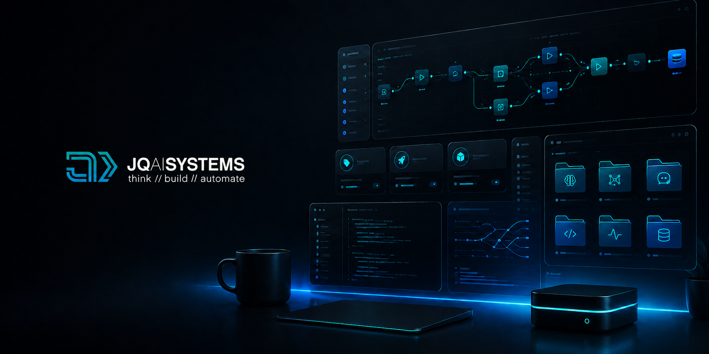
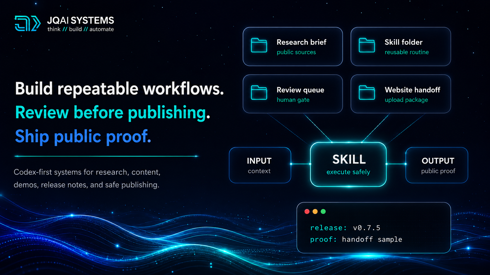
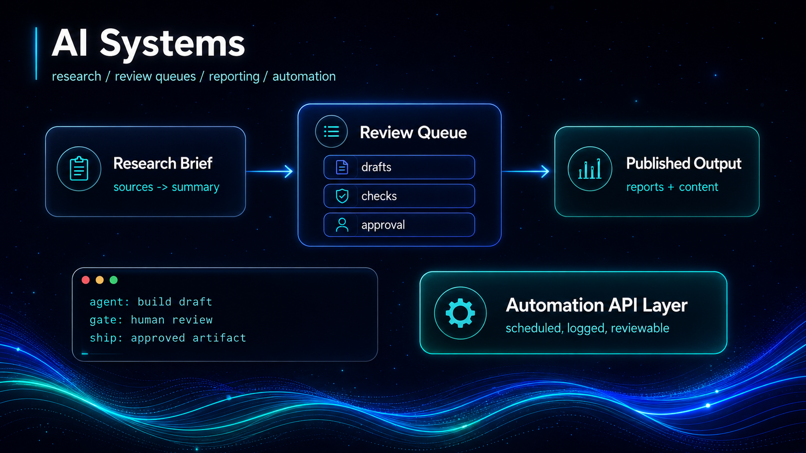
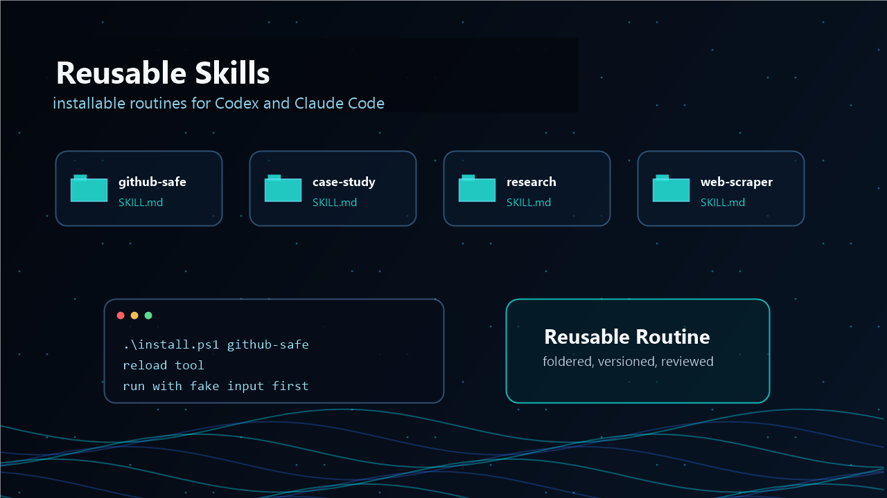
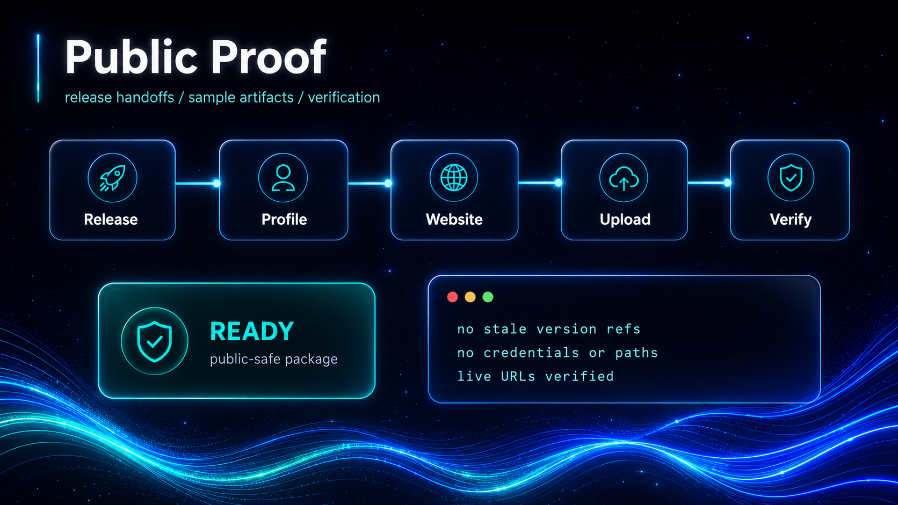
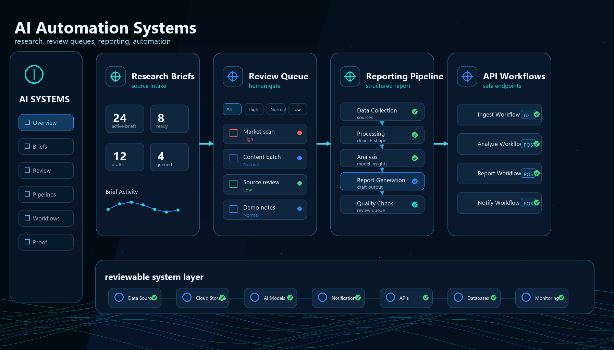
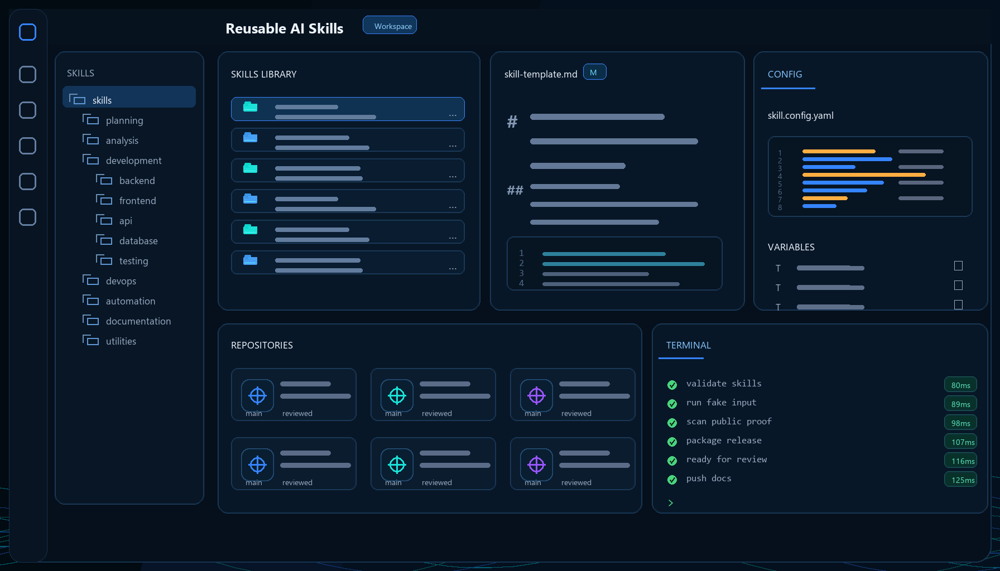
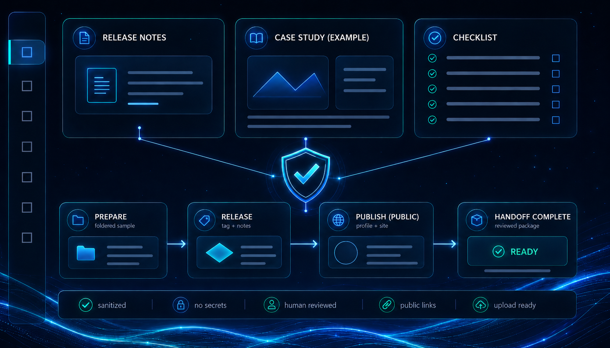

# Hey, I'm João

Founder of [JQ AI SYSTEMS](https://www.ai.joaoqueiros.com) - AI automation systems for studios, consultants, and small teams.

I build Codex-first AI systems, using Claude, OpenAI, Gemini, and automation APIs where they fit: research briefings, reporting tools, content pipelines, lead generation systems, review queues, and reusable AI skills.

My website is the main showroom. GitHub is the public proof layer: a place to inspect sanitized case studies, demo walkthroughs, and reusable AI skills without exposing sensitive implementation details or business data.

## Featured Release

[`jqai-ai-skills v0.7.5`](https://github.com/jqaisystems/jqai-ai-skills/releases/tag/v0.7.5) is the current public skills library release. It adds a release-to-showcase handoff proof sample, showing how a GitHub release moves into profile copy, website source updates, host upload packages, live verification, and final project notes.

Key proof links: [`release-showcase-handoff-sample.md`](https://github.com/jqaisystems/jqai-ai-skills/blob/main/docs/examples/release-showcase-handoff-sample.md), [`START_HERE.md`](https://github.com/jqaisystems/jqai-ai-skills/blob/main/START_HERE.md), [`QUICK_REFERENCE.md`](https://github.com/jqaisystems/jqai-ai-skills/blob/main/QUICK_REFERENCE.md), [`public-proof-index.md`](https://github.com/jqaisystems/jqai-ai-skills/blob/main/docs/examples/public-proof-index.md), [`skill-quality-matrix.md`](https://github.com/jqaisystems/jqai-ai-skills/blob/main/docs/skill-quality-matrix.md), and [`catalog.md`](https://github.com/jqaisystems/jqai-ai-skills/blob/main/docs/catalog.md).

Field note: [`From Prompt Library to Skill Library`](https://www.ai.joaoqueiros.com/blog/prompt-library-to-installable-ai-skills)

Announcement copy: [`announcements/jqai-ai-skills-v0.7.5.md`](announcements/jqai-ai-skills-v0.7.5.md)

## Workflow Map

## What I Build

<table>
  <tr>
    <td width="33%"></td>
    <td width="33%"></td>
    <td width="33%"></td>
  </tr>
</table>

- **Operational AI systems:** reporting tools, research briefings, content calendars, lead scoring, and client workflows.
- **Human-in-the-loop pipelines:** AI drafts and scores, but review queues keep publishing and outreach under human control.
- **Reusable AI infrastructure:** prompt libraries, skills, workflow templates, and source-owned client handoffs.

Image prompts and public-safe generation notes: [`assets/profile/README.md`](assets/profile/README.md)

## System Snapshots

Public-safe visual mockups of the kinds of systems I build, review, and publish.

### AI Automation Systems

### Reusable AI Skills Workspace

### Public Proof Workflow

## Featured System

[`AI News Curator`](https://www.ai.joaoqueiros.com/systems/ai-news-curator) is the newest live JQ AI SYSTEMS case study: a research briefing workflow that turns scattered AI, coding, design, and automation signals into a daily brief, organized archive, and human-reviewed public/private decision queue.

Live walkthrough: [`AI News Curator demo`](https://www.ai.joaoqueiros.com/demo/ai-news-curator.html)

Public proof: [`jqai-internal-systems/case-studies/ai-news-curator.md`](https://github.com/jqaisystems/jqai-internal-systems/blob/main/case-studies/ai-news-curator.md)

Announcement copy: [`announcements/ai-news-curator-live.md`](announcements/ai-news-curator-live.md)

## Public Proof

| Repository | What it shows |
|---|---|
| [`jqai-ai-skills`](https://github.com/jqaisystems/jqai-ai-skills) | MIT-licensed reusable AI skills for Codex/Claude-style workflows. Start with [`START_HERE.md`](https://github.com/jqaisystems/jqai-ai-skills/blob/main/START_HERE.md), inspect the [`public proof index`](https://github.com/jqaisystems/jqai-ai-skills/blob/main/docs/examples/public-proof-index.md), review the [`release showcase handoff sample`](https://github.com/jqaisystems/jqai-ai-skills/blob/main/docs/examples/release-showcase-handoff-sample.md), compare maturity in the [`quality matrix`](https://github.com/jqaisystems/jqai-ai-skills/blob/main/docs/skill-quality-matrix.md), and browse the [`complete catalog`](https://github.com/jqaisystems/jqai-ai-skills/blob/main/docs/catalog.md). |
| [`codex-control-center`](https://github.com/jqaisystems/codex-control-center) | Local-first Codex dashboard for observability, usage insights, vault health, and approval-gated workflow review. Open the [`live demo`](https://jqaisystems.github.io/codex-control-center/demo/). |
| [`jqai-internal-systems`](https://github.com/jqaisystems/jqai-internal-systems) | Sanitized case studies for systems built to run my own studio operations. Start here for client proof. |
| [`jqai-public-demos`](https://github.com/jqaisystems/jqai-public-demos) | Screenshots and live walkthrough links for public workflow demos. Watch how the systems behave. |

## Current Stack

Codex, Claude Code, Python/FastAPI, PHP, SQLite, OpenAI and Anthropic APIs, Firecrawl, Apollo, Buffer, Google Search Console, PostHog, Obsidian, and Adobe creative tools.

## How To Read This GitHub

If you are a potential client, start with the case studies and demos. If you are technical, inspect the skills repo. If you want the full offer, pricing logic, and contact path, use the website.

## Why The Full Source Is Not Here

Client work, private prompts, API credentials, databases, logs, deployment files, and raw business data stay private.

Want a system like this for your business? Start here: [ai.joaoqueiros.com/contact](https://www.ai.joaoqueiros.com/contact).

## Connect

